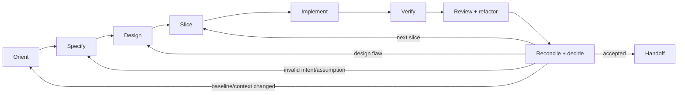

# Core Development Kernel

Read this reference for every non-trivial software build or change. The eight outcomes are mandatory; document depth, tool choice, and whether functions are performed by one agent, separate agents, automation, or humans are contextual.

## Control Loop

The loop is evidence-driven, not phase-driven. Move backward when evidence invalidates an earlier premise. Never preserve a plan merely because implementation has started.

## 0. Create the Development Contract

Before substantial work, write or state a compact contract containing:

- requested outcome and user or operator;
- engagement mode, scale, risk tier, and autonomy envelope;
- in-scope behavior and explicit non-goals;
- repository instructions and applicable domain packs;
- acceptance items and intended evidence;
- material assumptions, unknowns, and decisions reserved for the user;
- conditional modules currently required, skipped, or deferred.

Use the project system of record. For a short single-session feature, this may be a structured task note. For durable work, use the template in `artifact-contracts.md`.

The contract is living. Update it when user intent or verified reality changes; do not silently rewrite history.

## 1. Orient

### Purpose

Build the smallest trustworthy model of the current situation before proposing or changing code.

### Required actions

1. Confirm whether the user asked for analysis, planning, implementation, or end-to-end delivery. Read-only requests do not authorize edits or external mutations.
2. Read repository instructions and inspect current version-control state. Preserve unrelated and uncommitted work.
3. Select the engagement adapter and execute its baseline protocol.
4. Identify entry points, interfaces, data, dependencies, test commands, build/run path, and runtime evidence relevant to this change—not the entire system by default.
5. Classify evidence:
   - `observed`: reproduced from code, a running system, a test, a measurement, or an authoritative source;
   - `intended`: explicitly required by the user, approved spec, policy, or contract;
   - `inferred`: plausible but not directly verified;
   - `stale/conflicting`: contradicted by fresher evidence or another source;
   - `unknown`: material information not available.
6. Determine the risk tier, permission boundaries, domain needs, and conditional-module triggers.

### Exit

You can explain the current or initial state, desired delta, relevant constraints, evidence gaps, and how to reproduce the baseline. If the baseline cannot run, record why and establish the strongest alternative evidence before continuing.

## 2. Specify

### Purpose

Turn intent into a testable behavioral and quality contract without pretending uncertainty has disappeared.

### Required actions

- Describe the user-visible or operator-visible outcome before implementation details.
- Write concrete scenarios: inputs or actions, observable outputs or state, errors, boundaries, and permissions.
- State non-goals and compatibility promises so the agent cannot “helpfully” broaden the product.
- Define relevant quality attributes with budgets or thresholds where possible: security, privacy, performance, reliability, accessibility, maintainability, portability, cost, determinism, or reproducibility.
- Map every acceptance item to a planned oracle: test, property, contract, fixture, golden output, visual comparison, benchmark, runtime observation, expert judgment, or user confirmation.
- Label assumptions. If an unknown is cheap and safe to resolve, inspect or experiment. If it changes product identity, architecture, rights, or R2/R3 risk, obtain the accountable decision.
- When user value or feasibility is uncertain, formulate a falsifiable hypothesis and design the cheapest learning slice instead of manufacturing a detailed fictional requirement.

### Exit

Every in-scope behavior has an observable acceptance path, material ambiguity has an owner or experiment, and the specification is precise enough to reject an incorrect implementation.

## 3. Design

### Purpose

Choose the smallest coherent structure that satisfies the contract and preserves future change.

### Required actions

- Start from project and domain constraints, not framework fashion or model preference.
- Map affected components, interfaces, dependency direction, data ownership and lifecycle, state transitions, trust boundaries, failure handling, and concurrency where relevant.
- Compare meaningful alternatives when a choice is costly to reverse. Record the driver, selected option, rejected option, consequence, and reversal signal—not a ceremonial essay.
- Prefer existing conventions and stable seams in brownfield work. For greenfield work, prefer the minimum architecture that supports the next vertical slice and named quality attributes.
- Turn critical architecture rules into types, schemas, linters, contract tests, policy checks, or other executable constraints when practical.
- Incorporate the Domain Delta and all required conditional modules.
- Plan compatibility, migration, rollback, feature flags, or staged exposure when triggered; do not invent release machinery for an undistributed prototype.

### Exit

The implementation boundary, interfaces, main failure modes, validation strategy, and any consequential decisions are explicit. The design is narrow enough to implement and broad enough to expose hidden integration risk.

## 4. Slice

### Purpose

Select the smallest unit that produces user value or decisive learning and can be reviewed and verified independently.

### Slice criteria

A good slice is:

- independently understandable and as low-overlap with other work as practical;
- valuable to a user, operator, integrator, or current hypothesis;
- vertically connected through the required layers when possible;
- small enough that a reviewer can reason about the entire change;
- testable against explicit acceptance evidence;
- reversible, isolatable, or protected by a migration/rollout plan proportional to risk.

Do not split tightly coupled work merely to hit a file or time count. Do not group unrelated improvements into one “efficient” change. When a change cannot be small, create checkpoints with stable intermediate states and integration tests.

For multiple slices, create a dependency-aware work graph. Parallelize only nodes with stable contracts, low file/interface overlap, isolated environments, and a named integration path. Re-run combined verification after merging parallel outputs.

### Exit

The selected slice has one clear outcome, bounded files/interfaces, acceptance checks, and no hidden prerequisite that would make partial completion misleading.

## 5. Implement

### Purpose

Produce the smallest change that satisfies the slice while preserving the repository's integrity.

### Required actions

1. Reproduce the target failure or establish a failing/new acceptance check before the fix when practical. Do not create fake failures or brittle tests only to perform TDD theater.
2. Implement through existing abstractions unless the design explicitly justifies a new one.
3. Keep generated changes inspectable. Avoid speculative layers, unused options, copied boilerplate, unreviewed dependencies, and broad formatting churn.
4. Validate boundaries at boundaries: parse external inputs, keep secrets out of code and logs, preserve authorization, and prefer safe platform primitives.
5. Add or update tests and documentation that genuinely change with behavior. Do not make tests mirror implementation details so closely that both can share the same mistake.
6. Run fast targeted feedback throughout implementation; do not wait until a “test phase” after all code is written.
7. Update working state at the end of the slice so another context can reproduce what was done and what remains.

### Exit

The code builds or parses as applicable, targeted checks pass or have a classified failure, scope remains bounded, and the change is ready for broader verification.

## 6. Verify

### Purpose

Attempt to falsify completion with the strongest relevant, available oracles.

### Required actions

- Run targeted checks first for fast diagnosis, then the broader repository gates required by risk and scope.
- Inspect actual command output, application behavior, generated artifacts, screenshots, logs, metrics, or data results; do not rely on the agent's memory of what “should” pass.
- Use independent acceptance examples or properties for critical logic. Inspect generated tests for stubs, deleted assertions, excessive mocking, tautologies, and overfitting.
- Compare against the baseline and compatibility envelope. Distinguish new failures from verified pre-existing failures.
- Exercise negative, boundary, recovery, permission, and failure paths—not only the happy path.
- Run non-functional and domain oracles selected in `quality-and-risk.md` and the Domain Delta.
- Record each acceptance item as `passed`, `failed`, `blocked`, or `not run`, with the observed evidence and reason.

### Exit

Evidence is reproducible, covers the acceptance contract at the selected risk level, and makes remaining uncertainty visible. A broken environment or unavailable oracle is not a pass.

## 7. Review and Refactor

### Purpose

Evaluate the complete change, including its tests and assumptions, then improve structure without changing accepted behavior.

### Required review lenses

- intent, scenarios, non-goals, and scope;
- correctness, boundaries, failure modes, races, and resource lifecycle;
- APIs, schemas, migrations, data compatibility, and rollback;
- changed or deleted tests and whether they can detect a wrong implementation;
- dependencies, licenses/provenance, secrets, permissions, security, and privacy;
- architecture boundaries, reuse, naming, duplication, complexity, and repository conventions;
- domain invariants and required accountable review;
- accessibility, usability, performance, reliability, or reproducibility when triggered;
- documentation, observability, supportability, and removal of stale behavior.

Self-review every diff. Add a fresh-context, specialist, or independent review as required by risk. Review findings must name the failure condition and evidence; style preferences alone do not block completion unless they encode a repository rule.

Refactor after behavior is green: remove dead code, reduce accidental complexity, align abstractions, and make invariants legible. Re-run affected checks. If a structural refactor materially expands the diff, risk, or review surface, move it into its own slice instead of hiding it inside feature work.

### Exit

All blocking findings are fixed or explicitly owned, relevant checks remain green after cleanup, and residual design debt is visible rather than disguised.

## 8. Reconcile and Decide

### Purpose

Keep intent, implementation, evidence, and durable project memory aligned.

### Required actions

- Update the living specification when approved intent changed; preserve the decision history.
- Update architecture decisions, API/schema documentation, runbooks, user docs, examples, and agent instructions only where behavior or workflow actually changed.
- Reconcile the work graph and evidence matrix. Do not leave completed code attached to stale acceptance or an obsolete plan.
- Classify the next state:
  - `accept`: this slice meets its contract;
  - `iterate`: a concrete implementation or verification defect remains;
  - `redesign`: evidence invalidated the design;
  - `reframe`: the requirement or hypothesis is wrong or incomplete;
  - `blocked`: a decision, permission, dependency, environment, or domain authority is unavailable;
  - `stop`: marginal work is outside scope or no longer valuable.
- Feed recurring failures into project guardrails, tests, tools, or documentation. Do not add a universal rule from a single anecdote.

### Exit

The slice has a defensible state, the next action is explicit, and a new agent or human can continue without reconstructing hidden context.

## Failure Routing

| Failure Type | Return To | Response |
|---|---|---|
| Missing or stale evidence | Orient | Inspect the authoritative source or record the gap |
| Ambiguous or invalid behavior | Specify | Clarify, form a hypothesis, or obtain a decision |
| Incompatible or fragile structure | Design | Revisit interfaces, boundaries, or tradeoffs |
| Oversized or conflicting change | Slice | Reduce or reorder work; stabilize contracts |
| Code defect | Implement | Fix the root cause and add detecting evidence |
| Weak or unavailable oracle | Verify | Improve the harness, fixture, observability, or domain review |
| Review finding | Review/Implement/Design | Route to the earliest invalid premise, not just the latest file |
| Permission, rights, or accountable-risk boundary | Human gate | Stop the affected action and request the missing authority |

When the same failure recurs, do not repeat the same approach. State the failed hypothesis, identify the missing capability or constraint, and change the plan or escalate.
