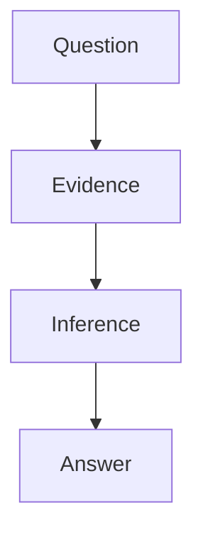

# Human-Facing Synthesis Rules

Use this reference when writing `final-synthesis.md` or any polished research memo from a domain-sensemaking workspace.

## Reader Calibration

Before drafting, infer or ask for the reader profile. If you must infer, write the assumption in the working notes and make the final document robust for a mixed audience.

| Reader signal | What to adapt |
|---|---|
| Reader knows the domain deeply | Skip elementary definitions, emphasize deltas, edge cases, evidence quality, and decision impact |
| Reader is new to the domain | Add threshold concepts, definitions on first use, examples, and a learning path |
| Reader must make a decision | Put recommendation, assumptions, tradeoffs, and reversal signals first |
| Reader must learn a domain | Put mental model, terminology, concept map, and competency questions first |
| Reader must implement | Put workflow, interfaces, failure modes, and validation steps first |

Default detail policy:

- `concise`: conclusion, 3-5 claims, key caveats, next actions.
- `standard`: conclusion, reasoning chain, claim/evidence table, diagram or mapping table, next actions.
- `teaching`: standard plus definitions, examples, glossary, and prerequisites.
- `layered`: start concise, then add deeper sections or separate appendix files.

## Explanation Policy

Use a term explanation when:

- the term is a threshold concept for the argument;
- misunderstanding it would change the conclusion;
- the reader profile does not list it as familiar;
- the term is used differently across fields.

Do not explain a term when:

- it is in the reader's known territory;
- it is only a label in a table and not needed to follow the argument;
- a link to an existing internal note is enough.

Good explanation pattern:

```markdown
贝叶斯认识论：把知识看成可随证据更新的置信度，而不是一次性判断真/假。这里对应 Agent 对 claim confidence 的连续更新。
```

For many unfamiliar terms, prefer a compact glossary or footnotes instead of interrupting the main argument.

## Argument Structure

`final-synthesis.md` should answer through a visible chain:

```text
Initial question
-> reframed question
-> key uncertainties
-> explored evidence
-> intermediate inferences
-> core answer
-> actions / open risks
```

Avoid these failure modes:

- Claim pile: many correct-looking claims with no connective tissue.
- Source pile: citations without interpretation.
- Method pile: research process details that do not change the answer.
- Jargon pile: advanced terms used as authority markers without teaching their role.

## Format Selection

| Content type | Preferred format | Why |
|---|---|---|
| Option comparison | Table | Keeps criteria aligned across options |
| Method-to-capability mapping | Table | Makes coverage and gaps scannable |
| Feedback loops or workflows | Mermaid flowchart | Shows order, branching, and feedback |
| Causal chain | Mermaid graph | Preserves why one step leads to another |
| State transitions | Mermaid state diagram | Clarifies phases, gates, and exit conditions |
| Sequence or interaction | Mermaid sequence diagram | Shows actors, handoffs, and response flow |
| Evidence ledger | Table or appendix | Separates source facts from synthesis |
| Definitions | Footnotes, glossary, or side table | Keeps main argument readable |
| Action plan | Checklist or numbered list | Supports execution |
| Long primers | Separate file linked from synthesis | Keeps final memo focused |

When Markdown Mermaid rendering is available, use embedded Mermaid code blocks for complex visualizations instead of ASCII diagrams. Use prose for the reasoning that connects table rows or diagram nodes. A diagram can show structure, but it does not replace the explanation.

Minimal Mermaid pattern:

````markdown

````

## Citation Policy

Cite or link:

- external papers, reports, datasets, articles, and product docs;
- internal repository documents, if they are evidence;
- direct quotes, numbers, dates, and named examples;
- controversial or high-impact claims.

Do not cite:

- the agent's own inference;
- general connective reasoning;
- definitions that are already explained in your own words unless the source matters.

Preferred Markdown forms:

- External source: `[Author Year](https://example.com)`
- Internal note: `[[Note Name]]` or `[Note Name](relative/path.md)`
- Footnote: `概念说明[^bayes]`

Keep citations close to the claim they support. If the source list is long, add `## Sources And Notes` and keep the main body readable.

## Split Criteria

Split the synthesis into multiple files when any of these are true:

- the main document exceeds roughly 2,500-3,500 words;
- a primer would distract readers who already know the field;
- the evidence table is large enough to obscure the argument;
- different audiences need different depths;
- a section is reusable as a standalone reference.

Recommended split:

```text
final-synthesis.md          # answer and reasoning chain
glossary.md                 # unfamiliar terms and primers
evidence-ledger.md          # source notes, claim evidence, quotes
implementation-playbook.md  # follow-up workflow if needed
```
