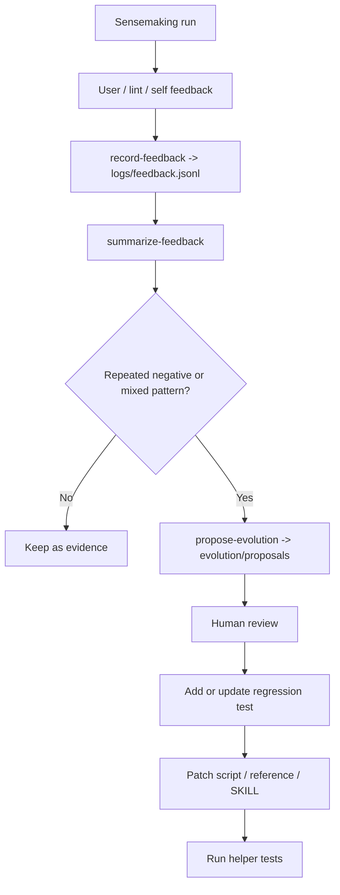

# Domain Sensemaking Self-Evolution

Use this reference when the user gives feedback on a domain-sensemaking output, or when repeated runs reveal a stable weakness in the skill.

## Principle

The skill may collect feedback and generate improvement candidates automatically. It must not rewrite its own `SKILL.md`, references, or scripts without human review and a regression test or pressure scenario.

## Feedback Loop



## Commands

```bash
python scripts/sensemaking_helper.py record-feedback --workspace path/to/workspace --artifact final-synthesis.md --dimension evidence --verdict negative --tag weak_sources --feedback "..."

python scripts/sensemaking_helper.py summarize-feedback --min-count 3

python scripts/sensemaking_helper.py propose-evolution --min-count 3
```

Default storage:

- Feedback log: `logs/feedback.jsonl` (relative to this skill's directory)
- Reviewable proposals: `evolution/proposals/YYYY-MM-DD-evolution-proposal.md`

## Dimensions

Use stable dimensions so repeated signals can be grouped:

| Dimension | Use For |
|---|---|
| `problem_framing` | Initial question, reframing, core uncertainties |
| `frontier` | Frontier coverage, ranking, next-node selection |
| `evidence` | Source quality, source notes, claim support |
| `traceability` | Rounds, source ids, claim-to-evidence links |
| `reader_fit` | Explanation depth, terminology, format, density |
| `actionability` | Next steps, experiments, design recommendations |
| `workflow` | Script use, convergence gate, process discipline |

## Tags

Prefer concrete tags over vague labels:

- `missing_source_notes`
- `weak_sources`
- `poor_reframing`
- `too_dense`
- `too_shallow`
- `unclear_next_actions`
- `false_convergence`
- `frontier_not_prioritized`
- `reader_mismatch`

## Promotion Rules

| Signal | Default Action |
|---|---|
| One-off preference | Record only |
| Repeated negative/mixed tag reaches threshold | Create proposal |
| Tool-enforceable issue | Add or update script/test first |
| Judgment issue | Add reference guidance or SKILL note |
| Output-format issue | Update templates and final synthesis guidance |

Threshold default: `min-count = 3`. Lower it only for severe issues that can corrupt evidence, pathing, or user trust.

## Human Review Gate

An evolution proposal is not an approved change. Before changing the skill:

- confirm the pattern is not a one-off taste preference;
- decide whether the fix belongs in scripts, references, or `SKILL.md`;
- write a failing regression test or pressure scenario first;
- avoid adding broad prose when a deterministic check can enforce the rule;
- verify with helper tests after the change.
