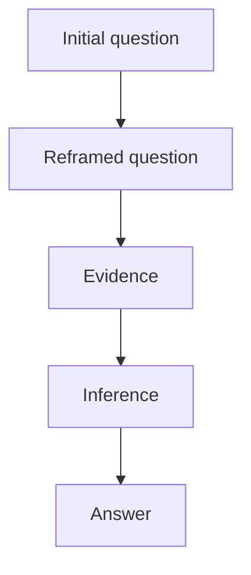

# Domain Sensemaking Templates

Use these templates when the user asks for a concrete workflow artifact or when the research is substantial enough to need traceability.

If a local runtime is available, prefer generating these files with:

```bash
python scripts/sensemaking_helper.py init --output path/to/workspace --question "..."
python scripts/sensemaking_helper.py select-frontier path/to/workspace --top 3 --focus "..."
python scripts/sensemaking_helper.py new-source path/to/workspace --title "..." --url "..."
python scripts/sensemaking_helper.py lint-workspace path/to/workspace
python scripts/sensemaking_helper.py check-convergence path/to/workspace/convergence.csv --workspace path/to/workspace
python scripts/sensemaking_helper.py record-feedback --workspace path/to/workspace --artifact final-synthesis.md --dimension evidence --verdict negative --tag weak_sources --feedback "..."
```

## Problem Card

```markdown
# Problem Card

Initial question:
Current reframing:
Mode:
Target output:

Core uncertainties:
- U1:
- U2:
- U3:

Known facts:
-

Initial hypotheses:
- H1:
- H2:

Constraints:
- Time:
- Data:
- Scope:
- Business/engineering boundary:

Draft convergence criteria:
-
```

## Reader Brief

Create this before `final-synthesis.md`.

```markdown
# Reader Brief

Primary reader:
Reader goal:
Known territory:
-
Needs explanation:
-
Detail policy: concise / standard / teaching / layered
Format policy:
- Tables:
- Diagrams:
- Lists:
- Prose:
- Appendices or split files:
Citation policy:
-
```

## Frontier Queue

```markdown
| Node | Type | Exploration purpose | Impact | Uncertainty | Explorability | Cost | Priority | Status |
|---|---|---|---:|---:|---:|---:|---:|---|
|  | concept / variable / method / evidence / case / controversy / hypothesis / decision |  |  |  |  |  |  | pending / explored / deferred |
```

Use a 1-5 score for `Impact`, `Uncertainty`, `Explorability`, and `Cost`. Higher `Cost` lowers priority.

Status values:
- `pending`: not yet explored.
- `explored`: investigated in a round (may also use `explored-light` for shallow passes).
- `deferred`: consciously skipped with stated reason (low marginal value, out of scope, etc.).

## Exploration Round

Create one file per round under `rounds/round-XX.md`.

```markdown
# Exploration Round XX

Focus:
Starting question:

## Selected Frontier

| Node | Reason selected | Expected uncertainty reduction |
|---|---|---|

## Evidence Collected

| Source | Claim or observation | Reliability | Effect on confidence |
|---|---|---|---|

## Graph And Claim Updates

- Relations added or revised:
- Claims added or revised:
- Contradictions or gaps added or revised:

## Question Reframe

Previous:
Current:
Why it changed:

## Round Decision

Decision: continue / pivot / deepen / converge
Reason:
Next frontier candidates:
-
```

## Source Note

Create one file per substantial source under `source-notes/source-XXX.md`.

```markdown
# Source Note source-XXX

Title:
URL or path:
Source type: web / paper / report / dataset / interview / internal-doc / observation / other
Accessed:
Reliability: high / medium / low

## Why This Source Was Read

Linked frontier nodes:
Linked round:

## Key Contents

-

## Claims Supported

| Claim | Evidence in this source | Confidence effect |
|---|---|---|

## Claims Contradicted Or Complicated

| Claim | Tension or counterevidence | Confidence effect |
|---|---|---|

## Concepts, Methods, Cases, Examples

-

## Reusable Notes

-

## Citation Handle

Use in synthesis as:
```

## Node Exploration Note

```markdown
## Node:

Type:
Exploration purpose:

### Definition

### Structure
- Related concepts:
- Related variables:
- Related methods:
- Related cases:
- Dependencies:

### Evidence
| Source | Claim | Evidence type | Reliability | Notes |
|---|---|---|---|---|

### Implication
- Question update:
- Hypothesis update:
- New frontier candidates:
```

## Concept Relation Table

```markdown
| A | Relation | B | Note |
|---|---|---|---|
|  | is-a / part-of / depends-on / causes / enables / contrasts-with / evolves-from / used-for / failure-mode-of |  |  |
```

## Claim-Evidence Table

```markdown
| Claim | Supporting evidence | Opposing evidence | Confidence | Decision relevance |
|---|---|---|---|---|
|  |  |  | high / medium / low |  |
```

Confidence guidance:

- `high`: multiple reliable sources or direct data support the claim; counterevidence is weak or explained.
- `medium`: plausible and supported, but limited by source quality, sample size, or unresolved assumptions.
- `low`: useful hypothesis, but evidence is thin, indirect, outdated, or mostly inferred.

## Coverage Matrix

Use when the research identifies multiple methods/tools/approaches that map to multiple capabilities/dimensions/stages, and you need to show which covers what. Typical cases: method-to-capability mapping, technology-to-requirement fit, skill-to-lifecycle coverage.

```markdown
| Method/Approach | Dimension A | Dimension B | Dimension C | Dimension D | Core mechanism | Evidence |
|---|:---:|:---:|:---:|:---:|---|---|
| Method 1 | ★★★ | ★★ | ★ | ★★ | one-sentence mechanism | reference or source |
| Method 2 | ★ | ★★★ | ★★ | ★ | one-sentence mechanism | reference or source |
```

Rating scale: ★ = weak/indirect, ★★ = moderate/partial, ★★★ = strong/primary.

Guidelines:
- Dimensions should be mutually exclusive capabilities or lifecycle stages.
- Each row should name its core mechanism (the primitive or operation it contributes).
- Include an Evidence column linking to source notes or papers.
- Use the matrix to identify coverage gaps (columns with no ★★★) and redundancy (rows with identical profiles).

## Contradiction And Gap Table

```markdown
| Type | Content | Likely cause | Next action | Resolution |
|---|---|---|---|---|
| contradiction / gap / isolated-node / assumption |  | definition / sample / time window / incentive / missing data / unknown |  |  |
```

The `Resolution` column captures how a contradiction was resolved when a design pattern or integration strategy emerges. Examples:
- "dual-track: Bayesian for continuous updates + falsification for hard constraints"
- "reflection budget: allocate reflection rounds by task complexity tier"
- "layered: use X at level A, Y at level B"

Leave blank for unresolved items. When resolution is filled, the item transitions from active tension to design knowledge.

## Convergence Checklist

```markdown
| Check | Status | Evidence |
|---|---|---|
| Question is specific enough to answer | pass / fail |  |
| Main graph has no critical isolated nodes | pass / fail |  |
| Key disagreements can be explained | pass / fail |  |
| Important claims have sufficient evidence or explicit uncertainty labels | pass / fail |  |
| Decision, explanation, experiment, or action can be derived | pass / fail |  |
| New exploration has low marginal value | pass / fail |  |
```

Before accepting convergence, run the helper with `--workspace` so the checklist is tested against auditability and evidence hygiene, not only manually written pass/fail cells.

## Workspace Lint

`lint-workspace` checks that substantial research has durable process and evidence artifacts:

| Check Area | Examples |
|---|---|
| Required files | problem card, reader brief, frontier, sources, relations, claims, contradictions, convergence, visual map, final synthesis |
| Audit trail | `rounds/round-XX.md` exists and records frontier choices |
| Frontier | rows with scores have computed priority |
| Claims | evidence, confidence, decision relevance, source ids for high-confidence claims |
| Sources | external citations in final synthesis have source notes |
| Final synthesis | required reader-facing sections are present |

## Feedback Event

Feedback is stored as JSONL so repeated signals can be summarized deterministically.

```json
{
  "event_id": "fb-...",
  "timestamp": "2026-04-29T00:00:00Z",
  "source": "user",
  "verdict": "negative",
  "rating": 2,
  "dimension": "evidence",
  "tags": ["weak_sources"],
  "feedback": "The output cites papers but does not preserve source notes.",
  "workspace": "path/to/workspace",
  "artifact": "final-synthesis.md",
  "run_id": ""
}
```

## Final Synthesis

```markdown
# Final Synthesis

## Reader Profile

- Primary reader:
- Assumed known territory:
- Terms explained here:
- Detail policy:

## Executive Summary

## Initial Question

## Question Evolution

## Reasoning Chain

Explain how the conclusion follows:

1. Key premise:
2. Evidence:
3. Inference:
4. Implication:

## Research Path

Keep this short. Reference `rounds/round-XX.md` for the auditable exploration trail; do not paste raw round history unless it changes the answer.

## Knowledge Graph Summary

For complex structures, include Mermaid directly:



## Core Claims

| Claim | Evidence | Reasoning | Confidence | Implication |
|---|---|---|---|---|

## Key Terms

| Term | Short explanation | Why it matters here |
|---|---|---|

## Contradictions And Unknowns

## Answer

## Next Actions

## Sources And Notes
```

Use `references/human-synthesis.md` to choose between tables, diagrams, lists, prose, citations, and split files.

## Mode-Specific Additions

### Learning

Add:

- Core terminology.
- Threshold concepts.
- Competency questions.
- Recommended learning path.
- Self-test prompts.

Converge when the user can explain the root problem, compare mainstream approaches, answer 10-20 competency questions, and place new material onto the existing map.

### Research / Engineering

Add:

- Falsifiable hypotheses.
- Design space.
- Minimum validation experiment.
- Failure modes.
- Evaluation metrics.
- Constraints matrix.

#### Testable Hypotheses Template

```markdown
## Testable Hypotheses

| ID | Hypothesis | Independent variable | Dependent variable | Expected effect | Measurement | Priority |
|---|---|---|---|---|---|---|
| H-test1 | Doing X improves Y | X (presence/absence or level) | Y metric | direction + magnitude estimate | how to measure | high/medium/low |
```

Each hypothesis should be falsifiable: state what observation would disprove it.

#### Minimum Validation Experiment Template

```markdown
## Minimum Validation Experiment

**Objective**: Test H-testN with minimum viable effort.

**Setup**:
- Subject/system:
- Baseline:
- Treatment:
- Sample size or scope:

**Protocol**:
1. Step 1
2. Step 2
3. Measure:

**Success criteria**: What outcome supports the hypothesis?
**Failure criteria**: What outcome falsifies it?
**Effort estimate**: time/cost/tokens
**Known risks**:
-
```

Converge when key hypotheses are testable, the design has measurable criteria, major risks have mitigations or alternatives, and the next step can become an experiment, prototype, or engineering plan.

### Consulting / Decision

Add:

- Decision statement.
- Evaluation criteria.
- Scenario analysis.
- Sensitivity analysis.
- Reversal signals.
- Counterargument.

Converge when the output can recommend an action, name the assumptions behind it, define signals that would change the recommendation, and convert uncertainty into monitoring or small tests.
