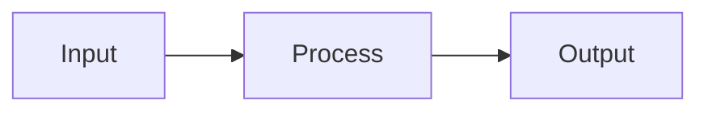

# My Presentation

Subtitle or occasion

<div class="pt-4 text-gray-400">
Your Name · Date
</div>

---
layout: default
class: agenda
---

# Agenda

1. What this deck demonstrates
2. The layout catalog in action
3. A visual variety tour
4. Closing notes

---
layout: default
class: content-bullets
---

# Content Bullets — the Workhorse

Use this for a claim plus 3-5 short supporting points.

<v-click>

- First key point

</v-click>

<v-click>

- Second key point

</v-click>

<v-click>

- Third key point

</v-click>

---
layout: default
class: code-focus
---

# Code Focus with Shiki

Shiki syntax highlighting with progressive line reveal:

```typescript {1|3-4|all}
// First click highlights line 1, then lines 3-4, then all
function greet(name: string): string {
  const message = `Hello, ${name}!`
  return message
}
```

---
layout: two-cols
class: two-columns
left:
  pattern: bullets
  items:
    - Left-side claim one
    - Left-side claim two
    - Left-side claim three
right:
  pattern: code
  language: python
  code: |
    def hello():
        return "right column"
---

# Two Columns — bullets × code

::left::

<div class="pattern-bullets">

- Left-side claim one
- Left-side claim two
- Left-side claim three

</div>

::right::

<div class="pattern-code">

```python
def hello():
    return "right column"
```

</div>

---
layout: default
class: three-metrics
---

# Three Metrics in a Row

<div class="metrics-row">
  <div class="metric">
    <div class="metric-value">42%</div>
    <div class="metric-caption">First metric</div>
  </div>
  <div class="metric">
    <div class="metric-value">1.2M</div>
    <div class="metric-caption">Second metric</div>
  </div>
  <div class="metric">
    <div class="metric-value">99.9%</div>
    <div class="metric-caption">Third metric</div>
  </div>
</div>

---
layout: default
class: diagram-primary
---

# Diagram Primary (Mermaid)



<div class="caption">A simple three-step flow</div>

---
layout: end
---

# Thank You

Questions & Discussion
