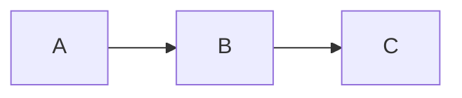
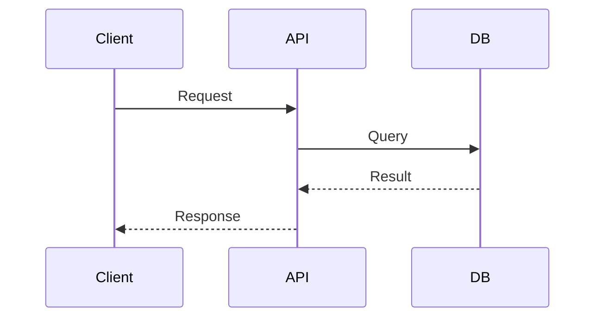

# Presentation Content Design Guide

> Universal principles for structuring effective slide decks. Domain-agnostic —
> works for technical talks, business pitches, educational lectures, or any topic.
> Read this when designing slide content in Step 2 of the workflow.

## Narrative Arc

Every presentation tells a story. Choose the arc that fits your purpose:

| Arc | Structure | Best for |
|-----|-----------|----------|
| Problem → Solution | Hook → Problem → Evidence → Solution → CTA | Pitches, proposals |
| Tutorial | Concept → Steps → Demo → Recap | Workshops, how-tos |
| Journey | Before → Turning point → After → Lessons | Case studies, retrospectives |
| Briefing | Context → Findings → Analysis → Recommendations | Reports, status updates |

If unsure, default to **Problem → Solution** — it works for most contexts.

## One Idea Per Slide

The single most impactful rule: each slide should communicate **one idea**. If you
need two sentences to describe what a slide is about, split it into two slides.

Signs a slide is overloaded:
- More than 5 bullet points
- More than 100 words of body text
- Two distinct topics sharing one heading
- Audience needs to read before they can listen

## Headline Discipline

Slide headings should be assertions, not labels:

| Weak (label) | Strong (assertion) |
|--------------|-------------------|
| "Q3 Results" | "Q3 Revenue Up 23%" |
| "Architecture" | "Three Services Replace the Monolith" |
| "Next Steps" | "Ship v2 by March" |

An audience member skimming only headings should grasp the full story.

## Text Density Guidelines

| Slide type | Target word count | Notes |
|-----------|------------------|-------|
| Title/cover | 10-20 | Title + subtitle + name |
| Key point | 30-60 | Heading + 3-5 bullets or short paragraph |
| Evidence/data | 20-40 | Let the chart/code speak; text supports |
| Quote | 15-30 | Quote + attribution only |
| Closing | 10-20 | Takeaway + call to action |

General rule: **40-80 words per content slide**. If a slide exceeds 120 words,
it probably needs splitting.

## When to Use Animations (v-click)

Animations control the audience's attention. Use them deliberately:

**Use v-click when:**
- Revealing a step-by-step process (each step builds on the previous)
- Showing a before/after comparison
- Delivering a punchline after setup
- Walking through code line by line

**Skip v-click when:**
- The slide has a simple list the audience can absorb at a glance
- The content is reference material (people will screenshot it)
- You are short on time — clicks slow delivery

**Guideline**: Aim for 30-50% of content slides to use animations. Below 20%
feels static; above 70% feels like every click is a speed bump.

## When to Use Code Examples

Code slides are powerful in technical talks but risky in general ones:

- **Show code** when the audience writes code and the syntax matters
- **Show pseudocode** when the logic matters but the language does not
- **Show a diagram** when the relationships matter more than the implementation
- **Show a bullet list** when the concept is simple enough to state in words

For code, use **line highlighting** (`{1|3-4|all}`) to guide focus. Never show
a full code block and expect the audience to find the important part themselves.

**Magic Move** (`````md magic-move`) is ideal for showing code evolution —
refactoring, adding types, progressive enhancement. Use it instead of side-by-side
comparisons. Important: Magic Move is **code-only**. It does not render Mermaid,
PlantUML, or any other diagram language.

## When to Use Mermaid Diagrams

Mermaid diagrams (` ```mermaid `) are built into Slidev. Use them for:

- **Flowcharts** — process flows, decision trees, system pipelines
- **Sequence diagrams** — API call flows, user interactions
- **Class/ER diagrams** — data models, architecture relationships

**Diagram complexity limits** — slides have a fixed viewport (~980×552 px).
A Mermaid diagram that exceeds half the slide height will push any content
below it off-screen. The audience cannot scroll. Additionally, Mermaid
renders SVGs at their **natural pixel width** — a diagram with many parallel
nodes can exceed the container width and be clipped. The starter template
includes `.mermaid svg { max-width: 100%; height: auto; }` as a safety net,
but wide diagrams still look cramped when force-shrunk.

| Diagram type | Safe complexity | Over-budget |
|-------------|-----------------|-------------|
| `flowchart LR` | 6-8 nodes, no subgraph | 10+ nodes, nested subgraph |
| `flowchart TB` | 4-5 rows | 6+ rows |
| `flowchart TB` with fan-out | 3 parallel nodes per row | 5+ parallel nodes — SVG will exceed slide width |
| `sequenceDiagram` | 4-5 participants, 8 messages | 6+ participants |

When a diagram is too complex:
1. **Scale down** — add `{scale: 0.7}` (or lower) after ` ```mermaid `
2. **Compact the slide** — use `zoom: 0.9` in frontmatter + `text-sm` body text
3. **Simplify** — remove nodes that don't serve the slide's one idea
4. **Switch direction** — `flowchart LR` uses less width for fan-out than `TB`
5. **Shorten labels** — abbreviate node text to 1-2 words
6. **Split** — show the overview on one slide, zoom into a section on the next
7. **Use text** — if the diagram is hard to read even at 0.6 scale, use
   a bullet list or ASCII box art in a code block instead

**Never put a wide Mermaid diagram inside a `grid grid-cols-2` column.**
A grid column is only ~470px wide — even a simple flowchart with 4+ parallel
nodes will overflow. Place diagrams in full-width sections, or use text in the
grid column and put the diagram above/below the grid.

At **Normal tier**, avoid combining a Mermaid diagram with a table or large
image. At **Compact tier** or **Dense tier**, side-by-side combinations in a
`grid grid-cols-2` are acceptable only if the Mermaid diagram is simple
(3 nodes or fewer in parallel) — use `{scale: 0.65}` on the Mermaid block and
`compact-table` on the table.

## Slide Space Budget & Density Control

Slides have a fixed, non-scrollable viewport (~980×552 px, ~480px usable below
the heading). Every element competes for this space. But the answer to "it might
overflow" is not always "split the slide" — splitting can fragment arguments and
weaken impact. Instead, use the right **density tier** for the content.

### Density Tiers

Choose the lightest tier that fits your content naturally:

**Tier 1: Normal** (default — no special CSS)
- One visual element + heading + 1-2 lines of text
- Suitable for ~80% of slides
- Element heights to budget against ~480px available:

| Element | Approximate height |
|---------|-------------------|
| Heading (h1) | ~60px |
| Bullet point | ~30px per line |
| Code block (5 lines) | ~150px |
| Mermaid (simple LR) | ~180px |
| Image (w-3/5) | ~250px |
| Table (3 rows) | ~120px |

**Tier 2: Compact** — for content that logically belongs together
- Add `zoom: 0.9` to the slide frontmatter
- Use `text-sm` (14px) for body text, `compact-table` for tables
- Constrain images with `max-h-72 object-contain`
- Budget expands to ~530px effective (0.9× scaling = 11% more room)
- Good for: visual + 3-4 bullets, two related diagrams side-by-side,
  comparison tables with 5-6 rows

```yaml
---
zoom: 0.9
---
```

**Tier 3: Dense** — for data-heavy slides where splitting destroys context
- Add `zoom: 0.75` to the slide frontmatter
- Wrap heavy visuals in `<Transform :scale="0.7">`
- Use `text-xs` (12px) for supporting text, `dense-table` for data tables
- Mermaid with `{scale: 0.55}`
- Budget expands to ~640px effective
- Use sparingly — for architecture overviews, multi-metric dashboards,
  side-by-side comparisons

```yaml
---
zoom: 0.75
---
```

### Combination Rules (what fits on one slide)

**Normal tier — single visual:**
- Heading + Mermaid (simple) + 1 sentence ✓
- Heading + image (w-3/5) + 1-2 bullets ✓
- Heading + code block (≤8 lines) + 1 v-click paragraph ✓
- Heading + table (≤4 rows) + 1 sentence ✓

**Compact tier — paired elements:**
- Heading + two-column grid: left text + right image ✓
- Heading + compact-table (5-6 rows) + 2 bullets ✓
- Heading + Mermaid `{scale: 0.7}` + 3-4 bullets ✓
- Heading + image `max-h-48 object-contain` + compact-table (3 rows) ✓

**Dense tier — dashboards / comparisons:**
- Heading + two-column grid with Mermaid left + table right ✓
- Heading + three metrics in a row + summary sentence ✓
- Heading + before/after code blocks in two columns ✓

**Always split (no density tier saves these):**
- Three or more full-size visual elements on one slide
- Code blocks ≥ 15 lines (unreadable when scaled)
- Text that would drop below ~11px effective font size
- Content that serves two genuinely separate ideas

### Practical Patterns

**Image that might overflow:**
```html

```
`max-h-80` (320px) caps the image height; `object-contain` preserves aspect
ratio; `w-auto` lets width adjust naturally.

**Dense comparison table:**
```html
<table class="compact-table">
  <thead><tr><th>Feature</th><th>Option A</th><th>Option B</th></tr></thead>
  <tbody>
    <tr><td>Speed</td><td>Fast</td><td>Moderate</td></tr>
    <!-- ... up to 6-8 rows safely -->
  </tbody>
</table>
```

**Two visuals side-by-side (compact tier):**
```html
<div class="grid grid-cols-2 gap-4">
  <div>



  </div>
  <div>

| Metric | Value |
|--------|-------|
| Latency | 12ms |
| Throughput | 5k rps |

  </div>
</div>
```

**Scaling a single heavy element:**
```html
<Transform :scale="0.7" origin="top center">



</Transform>

Key takeaway: the round-trip adds ~40ms latency.
```

### Image Sizing Guide

When embedding existing images (screenshots, data charts, concept art), choose
the right size tier to avoid overflow or wasted space. Slidev's viewport is
980×552 px — after title and padding, the usable content area is ~450px tall.

| Tier | CSS class | Height | Best for |
|------|-----------|--------|----------|
| Small | `max-h-48` | 192px | Supplementary icon, badge, small inline visual |
| Medium | `max-h-72` | 288px | Data chart, cost table screenshot, concept sketch |
| Large | `max-h-96` | 384px | Detailed diagram, wide screenshot, UI mockup |
| Full | `image-focus` layout | ~500px+ | Hero photo, branding, full-bleed visual anchor |

**Always combine with**: `object-contain` (prevent cropping) + `mx-auto` (center).
Optional: `rounded shadow` for polished look on light backgrounds.

```html
<!-- Medium: most common for data/chart images -->
<div class="flex justify-center mt-4">
  
</div>

<!-- Large: detailed diagrams needing more space -->
<div class="flex justify-center mt-2">
  
</div>
```

**Decision tree**:
- Is the image the *only* content on the slide? → `image-focus` layout (Full)
- Does the image need explanation text beside it? → `image-text-split` layout
- Is the image a data table/chart with a title above? → Medium (`max-h-72`)
- Is the image inside a `two-columns` column? → Small (`max-h-48`) or the
  `image` content pattern (`max-h-64`)
- Is the image detailed and needs study time? → Large (`max-h-96`)

## Visual Hierarchy

Guide the eye with size and weight:

1. **Heading** — largest, bold, colored (set by theme)
2. **Key phrase** — use `<v-mark>` to highlight within body text
3. **Body text** — normal weight
4. **Supporting detail** — smaller or muted color

Use **two-column layouts** (`grid grid-cols-2`) when comparing two things or
pairing text with a visual. Avoid more than two columns — slides are not
spreadsheets.

## Whitespace

Resist the urge to fill every pixel — but also resist the urge to split every
slide. Whitespace signals importance and reduces cognitive load. Use it
deliberately:

- **Normal-tier slides** should breathe — generous margins signal confidence.
- **Compact-tier slides** trade some whitespace for completeness — acceptable
  when the content forms one logical unit.
- **Dense-tier slides** minimize whitespace by design — reserve them for data
  comparisons where the density itself is the point.

If a slide feels cramped even at compact tier, split the content rather than
pushing to dense. Dense is a scalpel, not the default.

## Adapting to Audience

| Audience | Adjust |
|----------|--------|
| Technical peers | More code, deeper detail, fewer explanations of basics |
| Mixed technical | Pseudocode over real code, explain jargon, more diagrams |
| Executives | Fewer slides, bigger numbers, clear recommendations, no code |
| Students | More examples, more animations, recap slides between sections |

When in doubt, ask: "What does the audience need to **do** after this talk?"
Shape every slide toward that action.
