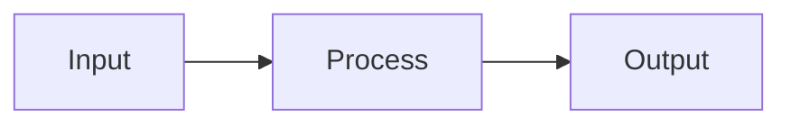
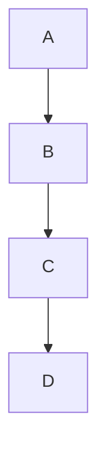
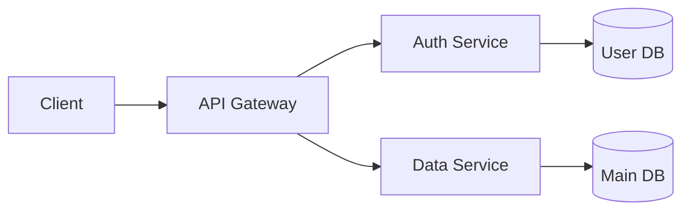

# Slidev Syntax Reference

> Complete syntax reference for Slidev presentations. Read this when you need details
> beyond the quick-reference table in SKILL.md.

## Slide Structure

### Slide Separator

Separate slides with three dashes on their own line:

```markdown
# Slide One Content

---

# Slide Two Content
```

**Critical**: Never use `---` inside slide content (divs, v-click, etc.). Use `<hr />` instead.

### Slide Layouts

Specify layout in per-slide frontmatter:

```markdown
---
layout: default
---

# Content using default layout
```

Common layouts:
- `default` — standard content slide
- `cover` — title/cover slide
- `center` — center-aligned content
- `two-cols` — two-column layout

---

## Text & Formatting

```markdown
# Heading 1
## Heading 2
### Heading 3

**bold** or __bold__
*italic* or _italic_
~~strikethrough~~

`inline code`

[link text](https://example.com)

> Blockquote spanning
> multiple lines
```

### Lists

```markdown
- Item 1
- Item 2
  - Nested item
- Item 3

1. First step
2. Second step
3. Third step
```

### Tables

```markdown
| Column 1 | Column 2 | Column 3 |
|----------|----------|----------|
| Cell A1  | Cell A2  | Cell A3  |
| Cell B1  | Cell B2  | Cell B3  |
```

### Images

```markdown


<!-- With custom size -->
{width=300px}
```

---

## Code Blocks

### Basic Syntax Highlighting

````markdown
```javascript
function hello(name) {
  return `Hello, ${name}!`
}
```
````

### Line-by-Line Highlighting

Click advances through highlighted lines:

````markdown
```typescript {1|3-4|all}
// Click 1: line 1 highlighted
function greet(name: string) {
  const msg = `Hello, ${name}`
  return msg
}
// Click 2: lines 3-4, Click 3: all
```
````

Syntax: `{1|2-3|all}` — pipe-separated ranges, each click advances to the next group.

### Magic Move (Code Animation)

Smooth character-level animation between code snapshots. Requires Slidev >= 0.48:

````markdown
````md magic-move
```typescript
// Step 1: Initial version
function add(a, b) {
  return a + b
}
```

```typescript
// Step 2: Add type annotations
function add(a: number, b: number): number {
  return a + b
}
```

```typescript
// Step 3: Add validation
function add(a: number, b: number): number {
  if (typeof a !== 'number') throw new Error('invalid')
  return a + b
}
```
```
````

Each click smoothly animates from one code block to the next.

**Important**: Magic Move is for **code-only** transitions. It does not render
Mermaid, PlantUML, or other diagram languages. Use ` ```mermaid ` for diagrams.

---

## Mermaid Diagrams

Slidev has built-in Mermaid support. Use a standard fenced code block with the
`mermaid` language identifier:

```markdown

```

### Scaling

Large diagrams can overflow the slide. Add `{scale: N}` to shrink:

```markdown

```

Scale values: `0.7` is a good starting point; go as low as `0.5` for complex
diagrams in dense-tier slides. Below `0.5`, text becomes hard to read — consider
simplifying the diagram or splitting across slides.

### Supported Diagram Types

- `flowchart LR` / `flowchart TB` — process flows (LR is more slide-friendly)
- `sequenceDiagram` — API/interaction flows
- `classDiagram` — class relationships
- `erDiagram` — entity relationships
- `gantt` — timelines
- `pie` — proportions
- `stateDiagram-v2` — state machines

### Space Guidelines

Slides cannot scroll. Keep Mermaid diagrams simple:
- Prefer `flowchart LR` over `flowchart TB` (horizontal uses less height)
- Limit to 6-8 nodes without subgraphs
- At **Normal tier**: avoid combining diagram + table or diagram + large image
- At **Compact/Dense tier**: side-by-side in `grid grid-cols-2` is fine with
  `{scale: 0.65}` on the diagram
- If the diagram is too complex, split across multiple slides

---

## Slide Density Controls

Slidev provides three mechanisms for fitting more content per slide without
overflow. Use the lightest approach that solves the problem.

### Slide Zoom (whole-slide scaling)

Scale the entire slide content uniformly via frontmatter:

```markdown
---
zoom: 0.9
---

# Dense Content Slide

This entire slide is rendered at 90% scale, giving ~11% more effective space.
```

Common values:
- `0.9` — Compact tier: slight shrink, barely noticeable
- `0.8` — Moderate: fits 25% more content
- `0.75` — Dense tier: maximum recommended density

### Transform Component (element-level scaling)

Scale a single element while keeping everything else at normal size:

```html
# Architecture Overview

<Transform :scale="0.7" origin="top center">



</Transform>

The gateway routes all requests through auth before reaching data services.
```

Props:
- `:scale` — number (e.g., `0.7` = 70% size). Default: `1`
- `origin` — CSS transform-origin (e.g., `"top center"`, `"top left"`). Default: `"top left"`

### Compact Tables

Use the `compact-table` CSS class (defined in the starter template's style.css)
to reduce font size and cell padding for data-dense tables:

```html
<table class="compact-table">
  <thead>
    <tr><th>Metric</th><th>Before</th><th>After</th><th>Change</th></tr>
  </thead>
  <tbody>
    <tr><td>Latency</td><td>120ms</td><td>45ms</td><td>-62%</td></tr>
    <tr><td>Throughput</td><td>1.2k</td><td>5.1k</td><td>+325%</td></tr>
    <tr><td>Error rate</td><td>2.3%</td><td>0.1%</td><td>-96%</td></tr>
    <tr><td>P99</td><td>800ms</td><td>120ms</td><td>-85%</td></tr>
    <tr><td>CPU usage</td><td>78%</td><td>42%</td><td>-46%</td></tr>
  </tbody>
</table>
```

For even denser data, use `dense-table` (smaller font, minimal padding).

### Image Containment

Prevent images from overflowing while preserving aspect ratio:

```html
<!-- Constrained height, auto width, centered -->


<!-- Smaller for compact slides -->

```

Key classes:
- `max-h-80` (320px), `max-h-72` (288px), `max-h-64` (256px) — height caps
- `object-contain` — shrinks to fit without cropping
- `w-auto` — width adjusts to maintain aspect ratio

---

## Interactive Elements

### Step-by-Step Reveal (v-click)

```html
<v-click>
First click reveals this
</v-click>

<v-click>
Second click reveals this
</v-click>
```

### Text Highlighting (v-mark)

```html
<v-mark type="underline" color="orange">underlined text</v-mark>
<v-mark type="circle" color="red">circled text</v-mark>
<v-mark type="highlight" color="yellow">highlighted text</v-mark>
<v-mark type="box">boxed text</v-mark>
<v-mark type="strike-through">struck text</v-mark>
```

Available types: `underline`, `circle`, `highlight`, `box`, `strike-through`
Colors: any CSS color name (`red`, `orange`, `yellow`, `green`, `blue`, `purple`, etc.)

### Vue Components

Full Vue 3 reactivity is available directly in slides:

```vue
<script setup>
import { ref } from 'vue'
const count = ref(0)
</script>

<button @click="count++">Click me</button>
<span>Count: {{ count }}</span>
```

---

## Layout Helpers

### Two-Column Layout

```html
<div class="grid grid-cols-2 gap-4">
  <div>Left column</div>
  <div>Right column</div>
</div>
```

All Tailwind CSS utility classes are available in Slidev.

### Centering Content

```html
<div class="flex items-center justify-center h-full">
  <p>Centered content</p>
</div>
```

### Custom HTML

Standard HTML works directly alongside Markdown:

```html
<div class="my-class">
  <p>Custom styling with HTML</p>
</div>

<hr class="my-3 opacity-30" />
```

---

## Presenter Notes

Add notes visible only in presenter view using HTML comments:

```html
<!-- This is a presenter note, not visible to audience -->
<!-- Remember to mention the three key points here -->
```

---

## Common Mistakes

| Don't | Do | Why |
|-------|-----|-----|
| Use `[[wikilinks]]` | Use `[text](url)` | Renders as raw text in Slidev |
| Use `npx slidev` | Use `npx @slidev/cli` | No npm package named `slidev` |
| Mix 3-backtick and 4-backtick fences in magic-move | Use 3-backtick for inner blocks, 4-backtick for the outer fence | Mismatched fences cause silent rendering failure |
| Put `<script setup>` inside a `<v-click>` | Place `<script setup>` at the top of the slide, outside any wrapper | Vue script blocks must be at the top level |
| Put Mermaid syntax inside magic-move | Use ` ```mermaid ` for diagrams, magic-move for code only | Magic-move does not render diagram languages |
| Use full-size images without height constraint | Add `max-h-80 object-contain` to `` tags | Unconstrained images overflow the viewport |
| Combine 3+ visuals at normal density | Use compact/dense tier or split into slides | Even with scaling, 3 full visuals will overflow |
| Set `zoom` below 0.7 | Split the slide instead | Text becomes unreadable below ~11px effective size |

Run `bash scripts/validate-slides.sh <path>` to catch syntax and frontmatter errors automatically.
See SKILL.md "Critical Gotchas" for the full list of known pitfalls.
